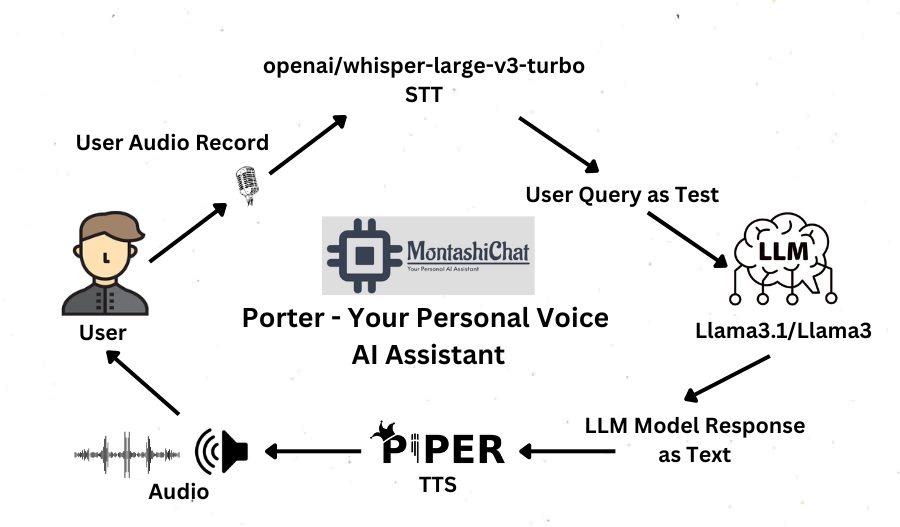
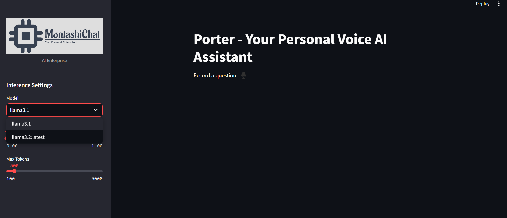
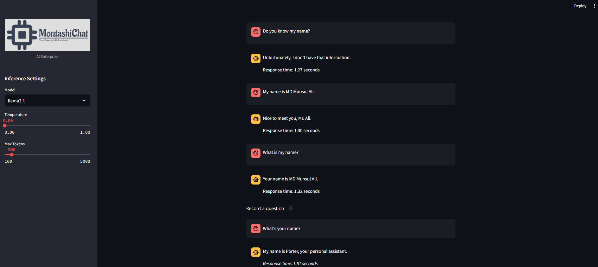

# Porter - Your Personal AI VoiceBot

Porter is a personalized AI VoiceBot built using Streamlit and LangChain. It is designed to provide concise, helpful responses to user queries. The application integrates Ollama's Llama models to deliver natural language processing capabilities, allowing users to engage in interactive conversations with a virtual assistant.



## Features

- **Interactive VoiceBot Interface**: Real-time voice interface built with Streamlit where users can ask questions as audio and receive answers.
- **Customizable AI Settings**: Users can select AI model versions (`llama3.1` or `llama3.2`), set the temperature for creative response variability, and limit the response token length via the sidebar.
- **Persistent Memory**: User and assistant conversations are stored in a local JSON file using LangChain’s `FileChatMessageHistory`, allowing for persistent session history.
- **Response Time Measurement**: Each response from Porter includes a time stamp indicating how long it took to generate the answer.
- **Document Upload**: Users can upload documents to assist Porter in answering questions related to specific content (feature implementation pending).

## Files Overview

1. **`apps.py`**:
   - Contains the Streamlit UI for interacting with Porter, including model selection, voice input, and voice chat history management.
   - The sidebar allows users to upload documents and adjust AI inference settings.
   
2. **`voicebot.py`**:
   - Houses the core logic for managing the VoiceBot interactions, including memory handling, model configuration, prompt setup, and LLM chain execution.
   - Leverages Ollama models via LangChain for robust language generation.
   - Voice Input & Transcription, Records and transcribes audio input into text, adding it to the chat.
   
## UI Interface



## How to Run

1. Clone the repository:
   ```bash
   git clone <repository-url>
   cd <repository-directory>

2. Install the required dependencies:

   ```pip install -r requirements.txt```
   
4. Run the Streamlit application:

   ```streamlit run apps.py```

## Technologies Used
- **Streamlit:** Interactive web-based interface.
- **LangChain:** Manages AI prompts, model configuration, and chat memory.
- **Ollama's Llama Models:** Provides the backbone for AI responses.
- **Openai/whisper-large-v3-turbo:** It`s an STT model from Whisper that converts audio into text.
- **Piper TTS:** It's a TTS model that converts text into audio in real-time.
- **JSON-based Memory:** Persistent chat history storage using local files.

## Future Improvements
Add support for document-based question answering by integrating document uploads into Porter’s memory.
Improve the voice interaction experience using Whisper model integration.
Expand model options to include more advanced language models as they are released.
